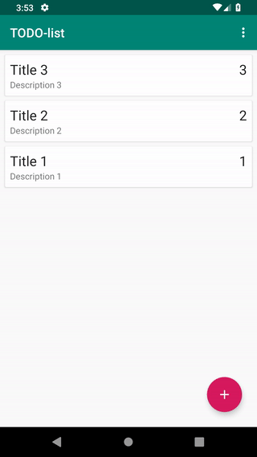
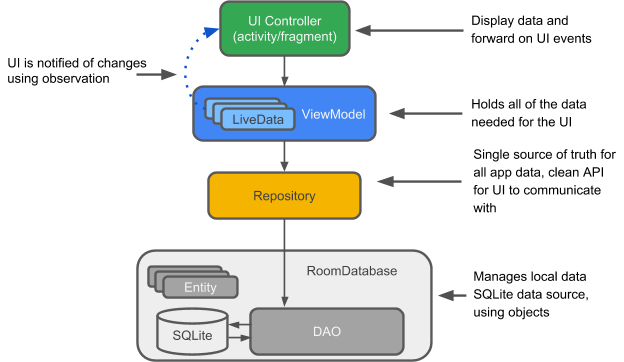

# To Do List - This is not your ordinary todo list!

A note taking app, using the Android Architecture Component libraries (`Room`, `ViewModel`, `LiveData`), a RecyclerView and Java. The data will be stored in an SQLite database and supports insert, read, update and delete operations.Together, this whole structure constitues an `MVVM (Model-View-ViewModel)` architecture, which follows the single responsibility and separation of concerns principles.

## Content

- [Why Android Architecture?](#why-android-architecture-components)
- [How Android Architecture Components Work](#how-android-architecture-components-work)
- [Build Instructions](#build-instructions)
- [Demo](#demonstration)

## Why Android Architecture Components?

Android architecture components are a collection of libraries that help you design robust, testable, and maintainable apps. Start with classes for managing your UI component lifecycle and handling data persistence.

* Manage your app's lifecycle with ease. New `lifecycle-aware components` help you manage your activity and fragment lifecycles. Survive configuration changes, avoid memory leaks and easily load data into your UI.
* Use `LiveData` to build data objects that notify views when the underlying database changes.
* `ViewModel` Stores UI-related data that isn't destroyed on app rotations.
* `Room` is an a SQLite object mapping library. Use it to Avoid boilerplate code and easily convert SQLite table data to Java objects. Room provides compile time checks of SQLite statements and can return RxJava, Flowable and LiveData observables.

## How Android Architecture Components work?

**Entity**: When working with Architecture Components, this is an annotated class that describes a database table.

**SQLite database**: On the device, data is stored in an SQLite database. For simplicity, additional storage options, such as a web server, are omitted. The Room persistence library creates and maintains this database for you.

**DAO**: Data access object. A mapping of SQL queries to functions. You used to have to define these painstakingly in your SQLiteOpenHelper class. When you use a DAO, you call the methods, and Room takes care of the rest.

**Room database**: Database layer on top of SQLite database that takes care of mundane tasks that you used to handle with an SQLiteOpenHelper. Database holder that serves as an access point to the underlying SQLite database. The Room database uses the DAO to issue queries to the SQLite database.

**Repository**: A class that you create, for example using the WordRepository class. You use the Repository for managing multiple data sources.

**ViewModel**: Provides data to the UI. Acts as a communication center between the Repository and the UI. Hides where the data originates from the UI. ViewModel instances survive configuration changes.

**LiveData**: A data holder class that can be observed. Always holds/caches latest version of data. Notifies its observers when the data has changed. LiveData is lifecycle aware. UI components just observe relevant data and don't stop or resume observation. LiveData automatically manages all of this since it's aware of the relevant lifecycle status changes while observing.

## Build Instructions

Android Studio 3.0 or later. Make sure Android Studio is updated, as well as your SDK and Gradle.

Add Following dependancy to `buil.gradle(Module:app)`:
 
  1. Room Dependancy 
    
    dependencies {
    
    def room_version = "1.1.1"
    
    implementation "android.arch.persistence.room:runtime:$room_version"
    annotationProcessor "android.arch.persistence.room:compiler:$room_version"
    
    }
    
  2. Dependencies for Lifecycle, including LiveData and ViewModel.
  
    dependencies {
    
    def lifecycle_version = "1.1.0"
    
    implementation "android.arch.lifecycle:extensions:$lifecycle_version"
    implementation "android.arch.lifecycle:viewmodel:$lifecycle_version"
    
    }

# Demonstration

    
    
